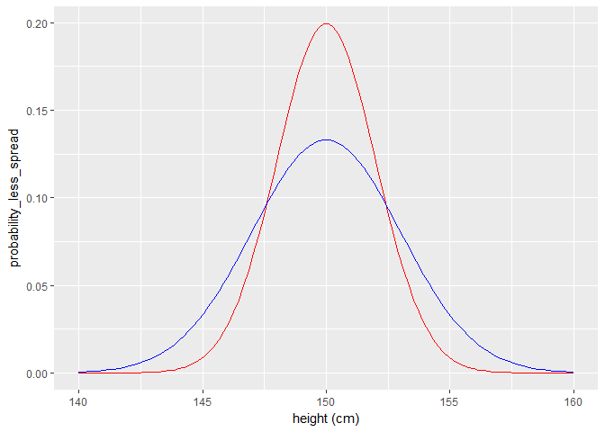
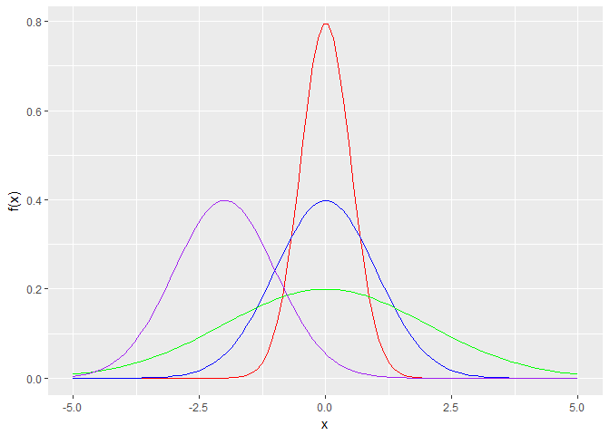
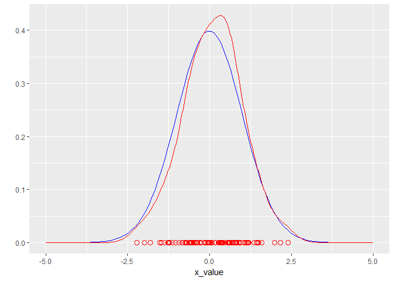
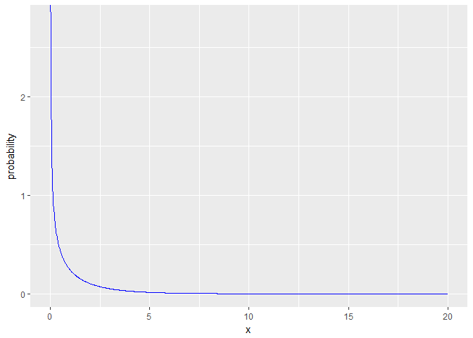

Seminar 2c
================
Julia A
January 17, 2018

Part 0
------

Inistiallize Libraries
----------------------

``` r
#install.packages("tidyverse")
library(tidyverse)
```

    ## Warning: package 'tidyverse' was built under R version 3.3.3

    ## -- Attaching packages ---------------------------------- tidyverse 1.2.1 --

    ## v ggplot2 2.2.1     v purrr   0.2.4
    ## v tibble  1.4.1     v dplyr   0.7.4
    ## v tidyr   0.7.2     v stringr 1.2.0
    ## v readr   1.1.1     v forcats 0.2.0

    ## Warning: package 'ggplot2' was built under R version 3.3.3

    ## Warning: package 'tibble' was built under R version 3.3.3

    ## Warning: package 'tidyr' was built under R version 3.3.3

    ## Warning: package 'readr' was built under R version 3.3.3

    ## Warning: package 'purrr' was built under R version 3.3.3

    ## Warning: package 'dplyr' was built under R version 3.3.3

    ## Warning: package 'forcats' was built under R version 3.3.3

    ## -- Conflicts ------------------------------------- tidyverse_conflicts() --
    ## x dplyr::filter() masks stats::filter()
    ## x dplyr::lag()    masks stats::lag()

Part 1
------

``` r
all_possible_heights <- seq(from = 140, to = 160, length = 100)
probability_values_less_spread <- dnorm(all_possible_heights, mean = 150, sd = 2)
probability_values_more_spread <- dnorm(all_possible_heights, mean = 150, sd = 3)

tibble(height = all_possible_heights, 
       probability_less_spread = probability_values_less_spread,
       probability_more_spread = probability_values_more_spread) %>% 
  ggplot() +
  geom_line(aes(x = height, y = probability_less_spread), color = "red") +
  geom_line(aes(x = height, y = probability_more_spread), color = "blue") +
  xlab("height (cm)")
```



Part 2
------

``` r
xValues <- seq(from = -5, to = 5, length = 100)
plotA <- dnorm(xValues, mean = 0, sd = 0.5) #
plotB <-  dnorm(xValues, mean = 0, sd = 1)
plotC <-  dnorm(xValues, mean = 0, sd = 2)
plotD <-  dnorm(xValues, mean = -2, sd = 1)

normalDistributionsTibble <- tibble(x_value = xValues, 
                                    red_value = plotA,
                                    blue_value = plotB,
                                    green_value = plotC,
                                    purple_value = plotD)

p <- normalDistributionsTibble %>% ggplot()
p + 
  geom_line(aes(x = xValues, y = red_value), color = "red") +
  geom_line(aes(x = xValues, y = blue_value), color = "blue") +
  geom_line(aes(x = xValues, y = green_value), color = "green") +
  geom_line(aes(x = xValues, y = purple_value), color = "purple") +
  xlab("x") +
  ylab("f(x)")
```



Part 3
------

``` r
meanValue <- 0
standardDeviation <- 1
numVals <- 100

xValues <- seq(from = -5, to = 5, length = numVals)
trueDistribution <- dnorm(xValues, mean = meanValue, sd = standardDeviation)

dataFrame <- tibble(x_value = xValues, true_value = trueDistribution)

set.seed(1)
randomVals <- rnorm(numVals, mean = meanValue, sd = standardDeviation)

dataFrame %>% ggplot() +
    geom_line(aes(x = x_value, y = true_value), color = "blue") +
    geom_line(aes(x = randomVals), color = "red", stat = "density") +
    geom_point(aes(x = randomVals, y = 0), color = "red", shape = 1, size = 3) +
    ylab("")
```



### Part 4

``` r
degreeFreedom <- 1

xValues <- seq(from = 0, to = 20, length = 1000)
probabilityValues <- dchisq(xValues, df = degreeFreedom)

dataFrame <- tibble(x = xValues, 
                    probability = probabilityValues)

dataFrame %>% ggplot() +
  geom_line(aes(x = x, y = probability), color = "blue")
```


