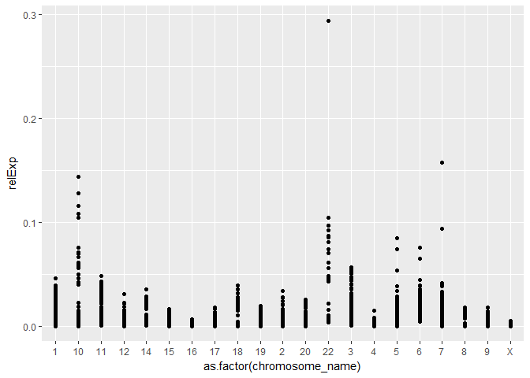
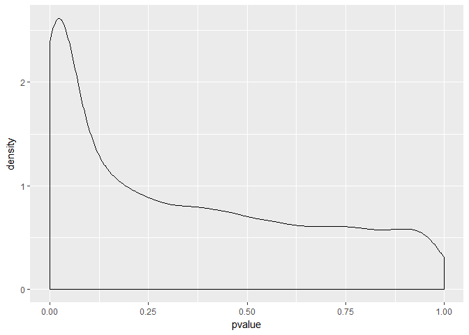

Seminar 3
================
Julia A
January 22, 2018

Install The Following
=====================

``` r
library(knitr)
```

    ## Warning: package 'knitr' was built under R version 3.3.3

``` r
library(GEOquery)
```

    ## Loading required package: Biobase

    ## Loading required package: BiocGenerics

    ## Loading required package: parallel

    ## 
    ## Attaching package: 'BiocGenerics'

    ## The following objects are masked from 'package:parallel':
    ## 
    ##     clusterApply, clusterApplyLB, clusterCall, clusterEvalQ,
    ##     clusterExport, clusterMap, parApply, parCapply, parLapply,
    ##     parLapplyLB, parRapply, parSapply, parSapplyLB

    ## The following objects are masked from 'package:stats':
    ## 
    ##     IQR, mad, xtabs

    ## The following objects are masked from 'package:base':
    ## 
    ##     anyDuplicated, append, as.data.frame, cbind, colnames,
    ##     do.call, duplicated, eval, evalq, Filter, Find, get, grep,
    ##     grepl, intersect, is.unsorted, lapply, lengths, Map, mapply,
    ##     match, mget, order, paste, pmax, pmax.int, pmin, pmin.int,
    ##     Position, rank, rbind, Reduce, rownames, sapply, setdiff,
    ##     sort, table, tapply, union, unique, unsplit, which, which.max,
    ##     which.min

    ## Welcome to Bioconductor
    ## 
    ##     Vignettes contain introductory material; view with
    ##     'browseVignettes()'. To cite Bioconductor, see
    ##     'citation("Biobase")', and for packages 'citation("pkgname")'.

    ## Setting options('download.file.method.GEOquery'='auto')

    ## Setting options('GEOquery.inmemory.gpl'=FALSE)

``` r
library(biomaRt)
library(tidyverse)
```

    ## Warning: package 'tidyverse' was built under R version 3.3.3

    ## -- Attaching packages ---------------------------------- tidyverse 1.2.1 --

    ## v ggplot2 2.2.1     v purrr   0.2.4
    ## v tibble  1.4.1     v dplyr   0.7.4
    ## v tidyr   0.7.2     v stringr 1.2.0
    ## v readr   1.1.1     v forcats 0.2.0

    ## Warning: package 'ggplot2' was built under R version 3.3.3

    ## Warning: package 'tibble' was built under R version 3.3.3

    ## Warning: package 'tidyr' was built under R version 3.3.3

    ## Warning: package 'readr' was built under R version 3.3.3

    ## Warning: package 'purrr' was built under R version 3.3.3

    ## Warning: package 'dplyr' was built under R version 3.3.3

    ## Warning: package 'forcats' was built under R version 3.3.3

    ## -- Conflicts ------------------------------------- tidyverse_conflicts() --
    ## x dplyr::combine()    masks Biobase::combine(), BiocGenerics::combine()
    ## x dplyr::filter()     masks stats::filter()
    ## x dplyr::lag()        masks stats::lag()
    ## x ggplot2::Position() masks BiocGenerics::Position(), base::Position()
    ## x dplyr::select()     masks biomaRt::select()

``` r
library(data.table)
```

    ## Warning: package 'data.table' was built under R version 3.3.3

    ## 
    ## Attaching package: 'data.table'

    ## The following objects are masked from 'package:dplyr':
    ## 
    ##     between, first, last

    ## The following object is masked from 'package:purrr':
    ## 
    ##     transpose

``` r
library(reshape2)
```

    ## Warning: package 'reshape2' was built under R version 3.3.3

    ## 
    ## Attaching package: 'reshape2'

    ## The following objects are masked from 'package:data.table':
    ## 
    ##     dcast, melt

    ## The following object is masked from 'package:tidyr':
    ## 
    ##     smiths

Part 1
------

``` r
gds <- getGEO("GDS507")
```

    ## File stored at:

    ## C:\Users\Julia\AppData\Local\Temp\RtmpAPFyup/GDS507.soft.gz

``` r
str(gds)
```

    ## Formal class 'GDS' [package "GEOquery"] with 3 slots
    ##   ..@ gpl      :Formal class 'GPL' [package "GEOquery"] with 2 slots
    ##   .. .. ..@ dataTable:Formal class 'GEODataTable' [package "GEOquery"] with 2 slots
    ##   .. .. .. .. ..@ columns:'data.frame':  0 obs. of  0 variables
    ##   .. .. .. .. ..@ table  :'data.frame':  0 obs. of  0 variables
    ##   .. .. ..@ header   : list()
    ##   ..@ dataTable:Formal class 'GEODataTable' [package "GEOquery"] with 2 slots
    ##   .. .. ..@ columns:'data.frame':    17 obs. of  4 variables:
    ##   .. .. .. ..$ sample       : Factor w/ 17 levels "GSM11810","GSM11815",..: 2 4 5 7 9 10 12 14 16 1 ...
    ##   .. .. .. ..$ disease.state: Factor w/ 2 levels "normal","RCC": 2 2 2 2 2 2 2 2 2 1 ...
    ##   .. .. .. ..$ individual   : Factor w/ 10 levels "001","005","011",..: 6 4 1 2 3 5 8 9 10 6 ...
    ##   .. .. .. ..$ description  : chr [1:17] "Value for GSM11815: C035 Renal Clear Cell Carcinoma U133B; src: Trizol isolation of total RNA from Renal Clear Cell Carcinoma t"| __truncated__ "Value for GSM11832: C023 Renal Clear Cell Carcinoma U133B; src: Trizol isolation of total RNA from Renal Clear Cell Carcinoma t"| __truncated__ "Value for GSM12069: C001 Renal Clear Cell Carcinoma U133B; src: Trizol isolation of total RNA from Renal Clear Cell Carcinoma t"| __truncated__ "Value for GSM12083: C005 Renal Clear Cell Carcinoma U133B; src: Trizol isolation of total RNA from Renal Clear Cell Carcinoma t"| __truncated__ ...
    ##   .. .. ..@ table  :'data.frame':    22645 obs. of  19 variables:
    ##   .. .. .. ..$ ID_REF    : Factor w/ 22646 levels "200000_s_at",..: 1 2 3 4 5 6 7 8 9 10 ...
    ##   .. .. .. ..$ IDENTIFIER: Factor w/ 16466 levels "ABCF1","ANAPC5",..: 53 10 68 46 20 18 52 90 25 25 ...
    ##   .. .. .. ..$ GSM11815  : num [1:22645] 4254 17996 41679 65391 19030 ...
    ##   .. .. .. ..$ GSM11832  : num [1:22645] 5298 12011 39117 34806 15814 ...
    ##   .. .. .. ..$ GSM12069  : num [1:22645] 4026 10284 38759 31257 16356 ...
    ##   .. .. .. ..$ GSM12083  : num [1:22645] 3498 2535 32848 28309 9580 ...
    ##   .. .. .. ..$ GSM12101  : num [1:22645] 3566 11048 39634 67448 14274 ...
    ##   .. .. .. ..$ GSM12106  : num [1:22645] 4903 13354 43511 56990 17217 ...
    ##   .. .. .. ..$ GSM12274  : num [1:22645] 6373 8564 46857 57973 19117 ...
    ##   .. .. .. ..$ GSM12299  : num [1:22645] 4829 17248 47032 57571 17488 ...
    ##   .. .. .. ..$ GSM12412  : num [1:22645] 5206 16018 22152 29062 14672 ...
    ##   .. .. .. ..$ GSM11810  : num [1:22645] 2757 6077 26661 35141 17733 ...
    ##   .. .. .. ..$ GSM11827  : num [1:22645] 3932 15704 26374 23629 18022 ...
    ##   .. .. .. ..$ GSM12078  : num [1:22645] 3730 10138 23810 22101 17957 ...
    ##   .. .. .. ..$ GSM12099  : num [1:22645] 3223 11614 24749 21651 15958 ...
    ##   .. .. .. ..$ GSM12269  : num [1:22645] 3640 8460 21937 18551 15800 ...
    ##   .. .. .. ..$ GSM12287  : num [1:22645] 4886 10283 31463 23497 16686 ...
    ##   .. .. .. ..$ GSM12301  : num [1:22645] 4070 11844 22734 21315 18817 ...
    ##   .. .. .. ..$ GSM12448  : num [1:22645] 3482 9742 25396 28631 17421 ...
    ##   ..@ header   :List of 23
    ##   .. ..$ channel_count           : chr "1"
    ##   .. ..$ dataset_id              : chr [1:12] "GDS507" "GDS507" "GDS507" "GDS507" ...
    ##   .. ..$ description             : chr [1:13] "Investigation into mechanisms of renal clear cell carcinogenesis (RCC). Comparison of renal clear cell tumor tissue and adjacen"| __truncated__ "RCC" "normal" "035" ...
    ##   .. ..$ email                   : chr "geo@ncbi.nlm.nih.gov"
    ##   .. ..$ feature_count           : chr "22645"
    ##   .. ..$ institute               : chr "NCBI NLM NIH"
    ##   .. ..$ name                    : chr "Gene Expression Omnibus (GEO)"
    ##   .. ..$ order                   : chr "none"
    ##   .. ..$ platform                : chr "GPL97"
    ##   .. ..$ platform_organism       : chr "Homo sapiens"
    ##   .. ..$ platform_technology_type: chr "in situ oligonucleotide"
    ##   .. ..$ pubmed_id               : chr "14641932"
    ##   .. ..$ ref                     : chr "Nucleic Acids Res. 2005 Jan 1;33 Database Issue:D562-6"
    ##   .. ..$ reference_series        : chr "GSE781"
    ##   .. ..$ sample_count            : chr "17"
    ##   .. ..$ sample_id               : chr [1:12] "GSM11815,GSM11832,GSM12069,GSM12083,GSM12101,GSM12106,GSM12274,GSM12299,GSM12412" "GSM11810,GSM11827,GSM12078,GSM12099,GSM12269,GSM12287,GSM12301,GSM12448" "GSM11810,GSM11815" "GSM11827,GSM11832" ...
    ##   .. ..$ sample_organism         : chr "Homo sapiens"
    ##   .. ..$ sample_type             : chr "RNA"
    ##   .. ..$ title                   : chr "Renal clear cell carcinoma (HG-U133B)"
    ##   .. ..$ type                    : chr [1:13] "Expression profiling by array" "disease state" "disease state" "individual" ...
    ##   .. ..$ update_date             : chr "Mar 04 2004"
    ##   .. ..$ value_type              : chr "count"
    ##   .. ..$ web_link                : chr "http://www.ncbi.nlm.nih.gov/geo"

``` r
meta_data <- data.frame(Sample = gds@dataTable@columns$sample, disease = gds@dataTable@columns$disease.state) #we grab this info from the appropriate slots above. 
data <- gds@dataTable@table
head(data)
```

    ##        ID_REF IDENTIFIER GSM11815 GSM11832 GSM12069 GSM12083 GSM12101
    ## 1 200000_s_at      PRPF8   4254.0   5298.2   4026.5   3498.4   3566.4
    ## 2   200001_at     CAPNS1  17996.2  12010.7  10283.5   2534.7  11048.4
    ## 3   200002_at      RPL35  41678.8  39116.9  38758.9  32847.7  39633.9
    ## 4 200003_s_at    MIR6805  65390.9  34806.2  31257.2  28308.5  67447.5
    ## 5   200004_at     EIF4G2  19030.1  15813.6  16355.7   9579.7  14273.5
    ## 6   200005_at      EIF3D   8824.5   9706.2  10590.0   6986.7   9400.4
    ##   GSM12106 GSM12274 GSM12299 GSM12412 GSM11810 GSM11827 GSM12078 GSM12099
    ## 1   4903.1   6372.6   4829.1   5205.8   2756.8   3932.0   3729.9   3223.4
    ## 2  13354.0   8563.8  17247.6  16018.5   6077.0  15703.8  10138.5  11614.4
    ## 3  43511.2  46856.7  47032.4  22152.2  26660.7  26373.6  23809.6  24749.3
    ## 4  56989.9  57972.5  57570.5  29062.2  35140.9  23629.3  22100.5  21651.0
    ## 5  17217.0  19116.9  17487.6  14671.6  17733.1  18022.4  17957.4  15958.0
    ## 6  12835.2  10299.0  12375.2   7645.4   8661.5   7355.7   6973.4   6855.9
    ##   GSM12269 GSM12287 GSM12301 GSM12448
    ## 1   3640.5   4886.3   4070.2   3482.1
    ## 2   8460.5  10282.6  11844.3   9741.6
    ## 3  21936.8  31462.8  22733.7  25395.5
    ## 4  18550.7  23496.5  21315.4  28631.4
    ## 5  15799.8  16685.8  18817.3  17421.1
    ## 6   7949.2   9486.5   7494.5   7252.1

``` r
dim(data)
```

    ## [1] 22645    19

``` r
apply(data[,-c(1, 2)], 2, median)
```

    ## GSM11815 GSM11832 GSM12069 GSM12083 GSM12101 GSM12106 GSM12274 GSM12299 
    ##    265.6    250.3    218.5    309.7    281.9    240.1    280.2    217.0 
    ## GSM12412 GSM11810 GSM11827 GSM12078 GSM12099 GSM12269 GSM12287 GSM12301 
    ##    264.4    273.8    264.6    266.5    269.3    288.6    238.7    244.5 
    ## GSM12448 
    ##    264.3

``` r
melted_data <- melt(data, id.vars = c("ID_REF", "IDENTIFIER"), var = "Sample")
head(melted_data)
```

    ##        ID_REF IDENTIFIER   Sample   value
    ## 1 200000_s_at      PRPF8 GSM11815  4254.0
    ## 2   200001_at     CAPNS1 GSM11815 17996.2
    ## 3   200002_at      RPL35 GSM11815 41678.8
    ## 4 200003_s_at    MIR6805 GSM11815 65390.9
    ## 5   200004_at     EIF4G2 GSM11815 19030.1
    ## 6   200005_at      EIF3D GSM11815  8824.5

``` r
#mean gene expression per sample
melted_data %>% 
    group_by(Sample) %>% 
    summarize(mean = mean(value))
```

    ## # A tibble: 17 x 2
    ##    Sample    mean
    ##    <fct>    <dbl>
    ##  1 GSM11815   751
    ##  2 GSM11832   742
    ##  3 GSM12069   748
    ##  4 GSM12083   735
    ##  5 GSM12101   803
    ##  6 GSM12106   744
    ##  7 GSM12274   761
    ##  8 GSM12299   802
    ##  9 GSM12412   685
    ## 10 GSM11810   765
    ## 11 GSM11827   780
    ## 12 GSM12078   774
    ## 13 GSM12099   766
    ## 14 GSM12269   710
    ## 15 GSM12287   791
    ## 16 GSM12301   770
    ## 17 GSM12448   757

``` r
#mean of each probe's expression
new_melted_data <- melted_data %>% 
    group_by(Sample, IDENTIFIER) %>% 
    summarize(Count = mean(value))

#function that takes in data frame, and outputs same data frame with associated chromosome annotations.
identify_gene_names <- function(df){
    names(df) <- c("Sample", "hgnc_symbol", "Count")
    names <- getBM(attributes=c("hgnc_symbol", "chromosome_name") , filters= "hgnc_symbol", values = df$hgnc_symbol, mart = human)
    left_join(df, names, by = "hgnc_symbol")
}

data_with_chromosome <- read.csv("https://raw.githubusercontent.com/STAT540-UBC/STAT540-UBC.github.io/master/seminars/seminars_winter_2017/Seminar3/biomart_output.csv", header=TRUE)

full_data <- left_join(data_with_chromosome, meta_data, by = "Sample")

full_data %>% 
    group_by(disease) %>% 
    filter(chromosome_name == "X") %>% 
    summarize(mean = mean(Count))
```

    ## Warning: package 'bindrcpp' was built under R version 3.3.3

    ## # A tibble: 2 x 2
    ##   disease  mean
    ##   <fct>   <dbl>
    ## 1 normal    729
    ## 2 RCC       674

``` r
#choose random number between 1 and however many genes we have. 
sample_to_choose <- sample(1:length(unique(full_data$hgnc_symbol)), size = 100)
#choose genes that correspond to those numbers in a list of genes. 
names_to_choose <- as.character(unique(full_data$hgnc_symbol)[sample_to_choose])

full_data %>% 
    filter(hgnc_symbol %in% names_to_choose) %>% 
    group_by(Sample) %>% mutate(relExp = Count/sum(Count)) %>%
    ggplot(aes(x = as.factor(chromosome_name), y = relExp)) + geom_point()
```



``` r
full_data %>% 
    group_by(hgnc_symbol) %>% 
   summarize( pvalue = t.test(Count ~ disease)$p.value) %>%
   ggplot(aes(x = pvalue)) + geom_density() 
```



``` r
data_05 <- full_data %>% 
    group_by(hgnc_symbol) %>% 
    summarize(pvalue = t.test(Count ~ disease)$p.value) %>% 
  filter(pvalue < 0.05)

data_05
```

    ## # A tibble: 2,531 x 2
    ##    hgnc_symbol   pvalue
    ##    <fct>          <dbl>
    ##  1 A1BG-AS1    0.0366  
    ##  2 A2MP1       0.0245  
    ##  3 AADAT       0.0304  
    ##  4 AAED1       0.0367  
    ##  5 AAK1        0.0229  
    ##  6 AARS2       0.0416  
    ##  7 ABCB1       0.00351 
    ##  8 ABCB10      0.0302  
    ##  9 ABCC3       0.0342  
    ## 10 ABCC6P1     0.000528
    ## # ... with 2,521 more rows
